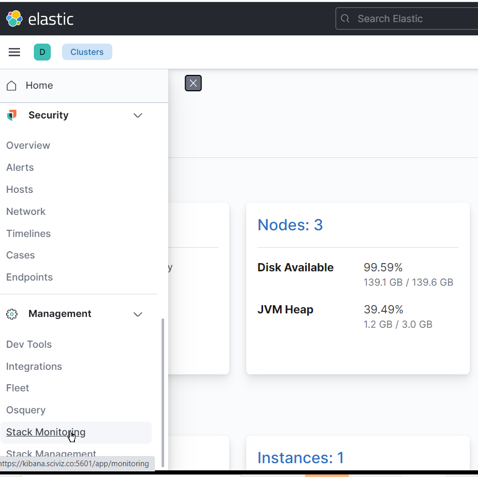
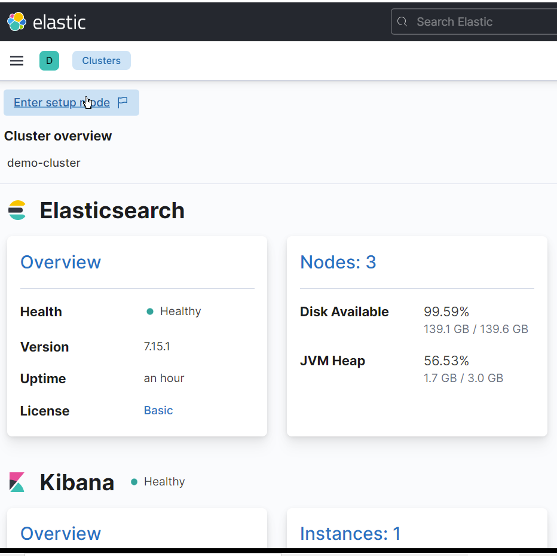
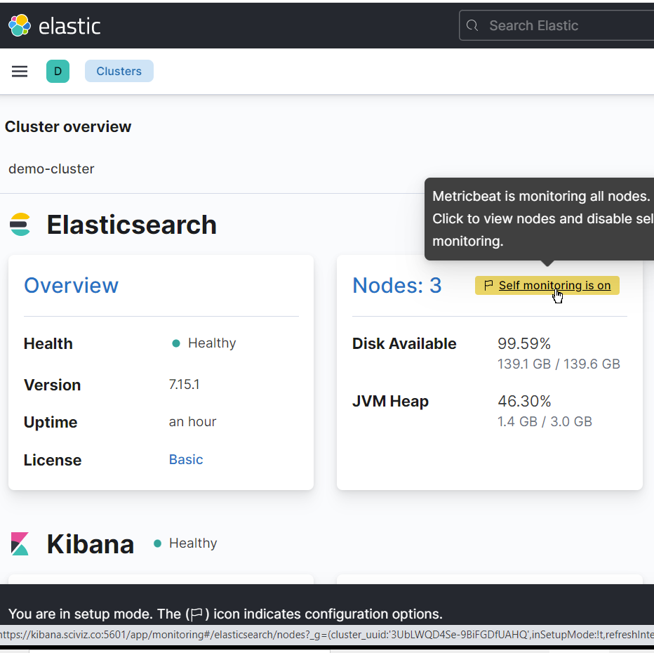
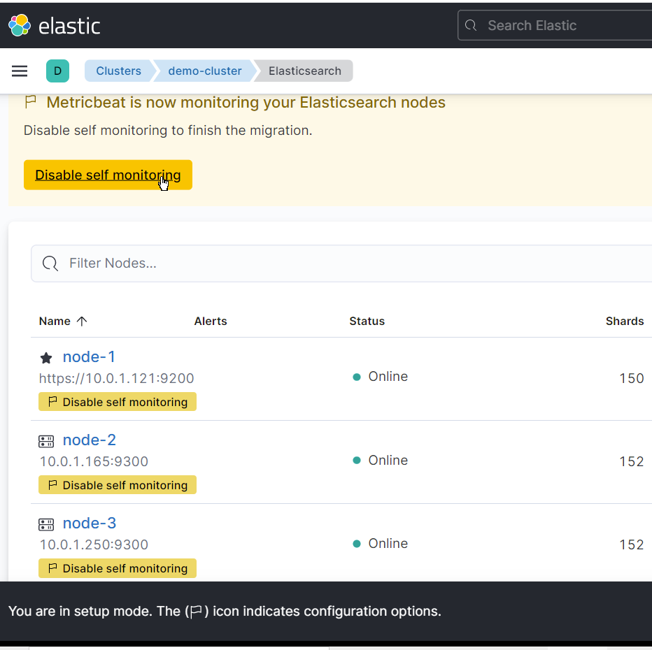
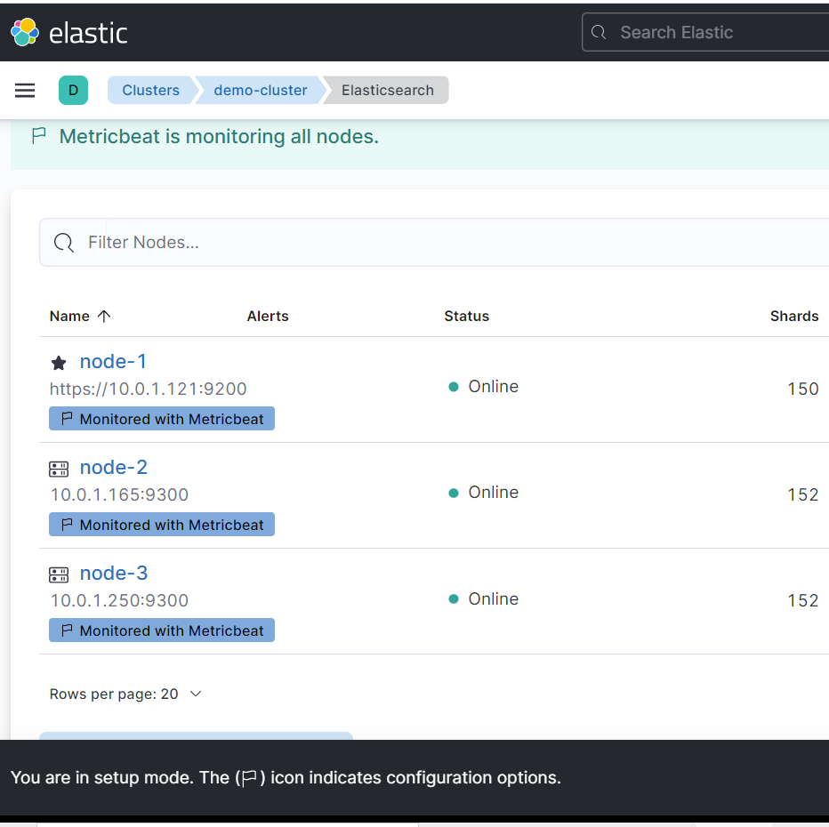
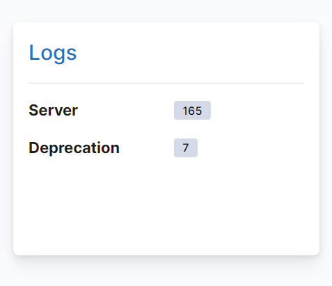

### Beats

Download the role

```shell
git clone https://github.com/elk-ansible/ansible-beats.git
cd ansible-beats
git checkout Feature-keystore
```
Update your inventory variable to match the list of es nodes internal
ips or DNS names for your cluster.
```shell
ansible-playbook -i inventory-elk/ playbook-beats-metricbeat.yml 
ansible-playbook -i inventory-elk/ playbook-beats-metricbeat-kibana.yml
ansible-playbook -i inventory-elk/ playbook-beats-filebeat.yml
```
Go to Kibana->Setting->Monitoring



Click on the top right button "Enter Setup Mode"



Disable self monitoring


Disable Self Monitoring



Exit Setup Mode red button at the bottom left


Similarly  for Filebeat in the Kibana->Setting->Monitoring we would see some the logs 

