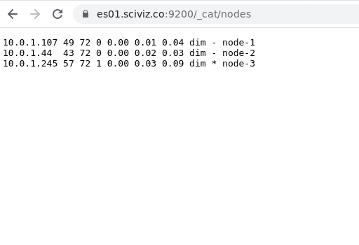
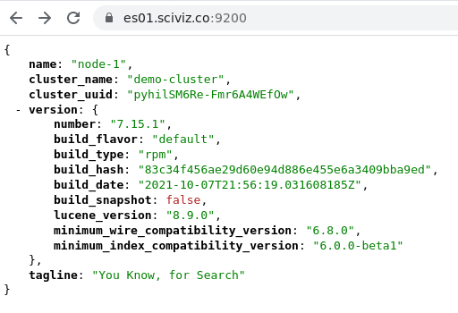
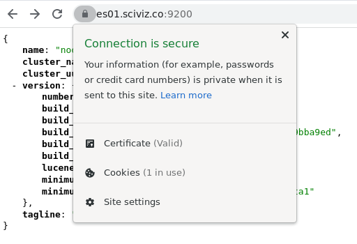

 #### Get the Ansible role for Elasticsearch 
We will be checking out the code for the roles instead of using Ansible galaxy  

```shell
mkdir roles
cd roles
```


```shell
mkdir roles && cd roles
git clone https://github.com/elastic/ansible-elasticsearch
cd ansible-elasticsearch/
git checkout tags/v7.15.1

```

#####  Install our 3 node elasticsearch cluster
```shell
export ANSIBLE_HOST_KEY_CHECKING=False
ansible-playbook -i inventory-elk/ playbook-elasticsearch-cluster.yml
```
Visit your domain.
[https://es01.sciviz.co:9200/_cat/nodes](https://es01.sciviz.co:9200/_cat/nodes)

List of cluster node, Single Nodes information and Valid SSL certificate





