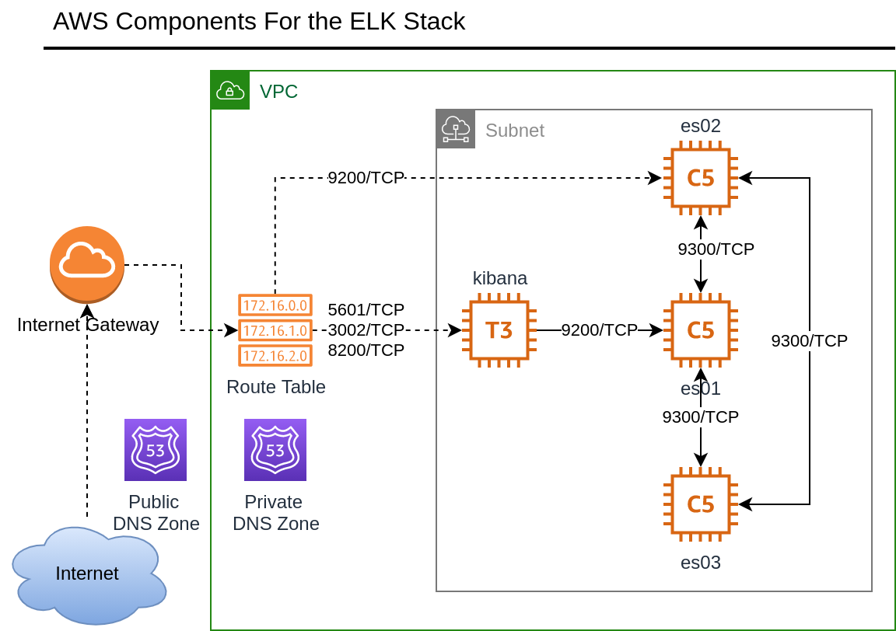
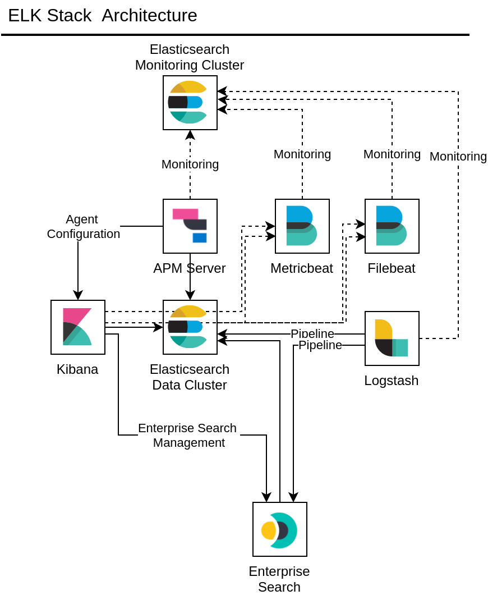
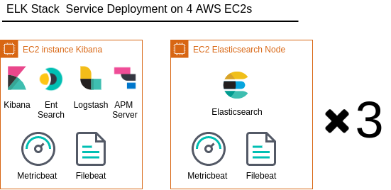

### Deploy and Configure  ELK with Terraform and Ansible
This is a complete end-to-end tutorial demonstrating deployment all the ELK stack components on compute nodes with Ansible and Terraform.

It is 3 steps 
1. `terraform apply` for the infrastructure deployment. 
2. `acme.sh` certbot from Let's Encrypt for our  certificates and `openssl` to generate our PKCS12 files. 
3. `ansible-playbook -i inventoty-elk/ playbooke-{service-name}.yml` in order to install and configure.

#### AWS Infrastructure Overview 
We will provision dedicated infrastructure on AWS.
The entire deployment is on a dedicated Internet Gateway, VPC, Route 53 for managing the Public and Private DNS names and EC2 compute nodes.
See the diagram below for details.

#### ELK Stack Components Overview  
Then we will install and configure 3 Node elasticsearch cluster on dedicated compute instances. 
On a separate compute instance we will install and configure Kibana, Logstash, Enterprise Search, APM server.
On each compute we will also deploy and configure Metricbeats and Filebeats for cluster metrics and observability.

All the service endpoints and communications are encrypted with a signed certificate from Let's Encrypt certificate authority
with DNS that is controlled by the AWS Route 53 Service so that Full SSL verification mode.

All the secrets are secured in the respective service keystore. The only exception is the Enterprise Search since they do not 
provide native keystore at this time.

Logically the Main Elasticsearch and Monitoring clusters are two separate configuration items controlled by
their respective Ansible inventory variables.
Physically we will be using the same elasticsearch cluster. 

#### Service layout on the EC2
We are deploying the services on four EC2s. One shared EC2 for the Kibana, Logstash, APM server and Enterprise Search and on rest for the 3 node Elasticsearch cluster.
Filebeat and metricbeat is deployed on each EC2. 
For this setup we will use the same 3 node cluster as a monitoring cluster. In the playbooks  input Variables  configurations we have dedicated entries for the monitoring cluster.bnh  

#### Detailed Step-by-Step Guides 
1. Run terraform to provision the infrastructure is described in a separate repository [https://github.com/mirkenstein/elk-ec2-terraform-aws](https://github.com/mirkenstein/elk-ec2-terraform-aws)
2. Preparatory steps
   1. [Configure your DNS provider to use the AWS Nameservers](./README_DNS.md) 
   2. [Generate the SSL certificates for our domain with Lets Encrypt acme.sh script](./README_SSL_CERTS.md)
   3. [Create the entries for our ssh config files that we will use for the ansible inventory](./README_PREPARE_ANSIBLE.md)
   
3. Adjust the inventory file settings and run the Ansible playbooks to deploy the following components
   1. [3 Node Elasticsearch Cluster](./INSTALL_ELASTIC.md)
   2. [Kibana](./INSALL_KIBANA.md)
   3. [Beats](./INSTALL_BEATS.md)
   4. [Enterprise Search](./INSTALL_ENT_SEARCH.md)
   5. Logstash ..coming soon
   6. [APM server](./INSTALL_APM_SERVER.md) 

